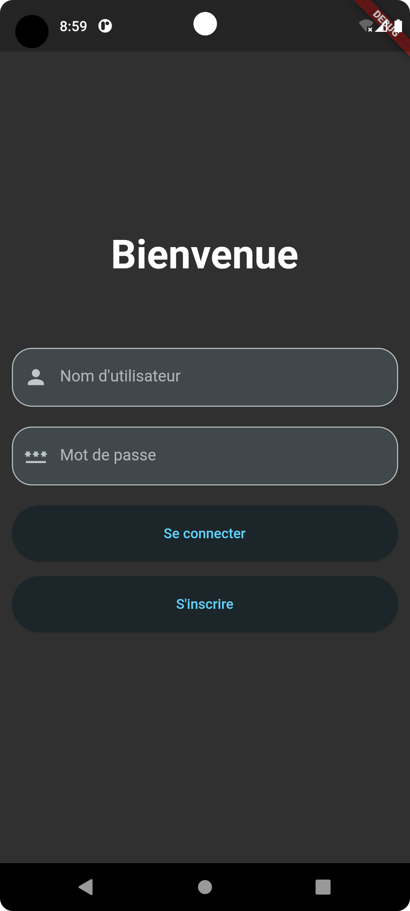
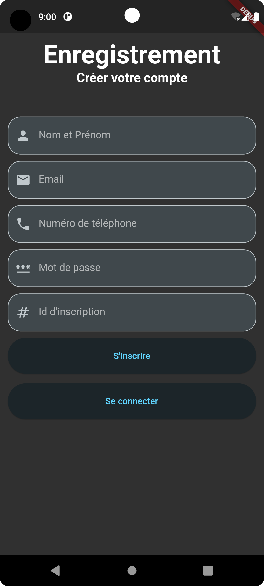
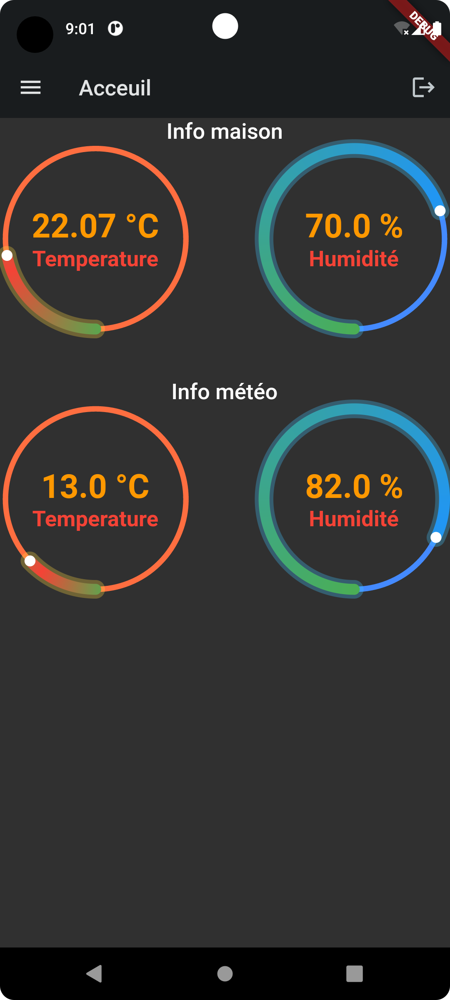
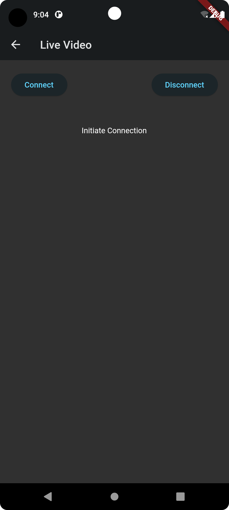

# Project name :
Mamaison
## Description:
MaMaison is a home monitoring and automation application built using Flutter framework. It provides features to monitor temperature, humidity, and weather conditions, as well as controlling home devices remotely. The application includes functionalities like user authentication, live video streaming, and real-time data updates.
## Features:
1. **Dashboard**: View real-time information about temperature, humidity, and weather conditions for your home.
2. **Authentication**: Users can sign up and log in securely to access the application features.
3. **Live Video Streaming**: Stream live video from home cameras for remote monitoring.
4. **Home Automation**: Control home devices remotely based on the monitored data.
5. **Responsive Design**: The application is designed to work seamlessly across various screen sizes and orientations.
## Technologies Used:
- **Flutter**: for building cross-platform mobile applications.
- **Dart**: programming language used with Flutter.
- **RESTful APIs**: for fetching and updating data from the server.
- **WebSocket**: for real-time communication, especially for live video streaming.
- **JSON**: for data serialization and deserialization.
- **HTTP package**: for making HTTP requests to APIs.
- **Material Design**: for a consistent and visually appealing user interface.
## Installation:
1. Clone the repository to your local machine.
2. Ensure you have Flutter installed and configured properly.
3. Run flutter pub get to install dependencies.
4. Connect your device or start an emulator.
5. Run flutter run to launch the application on your device or emulator.
## Screenshots

  

    
    
  

  

    
    
  

